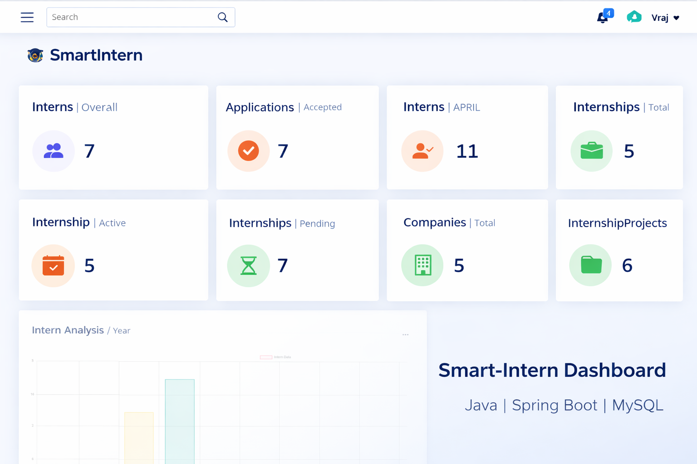

# 🚀 Smart-Intern Web Application

## 📌 Overview
Smart-Intern is a full-stack internship management platform designed to streamline the process of internship applications and management. The system supports multiple user roles including Admin, Students, and Mentors, with secure authentication and role-based access.

---

## 🛠️ Tech Stack
- **Backend:** Java, Spring Boot, Hibernate
- **Database:** MySQL
- **Security:** Spring Security, Session-based Authentication (HttpSession), BCrypt
- **APIs & Tools:** Cloudinary, JavaMail API, Authorize.Net
- **Architecture:** MVC (Model-View-Controller)

---

## ✨ Features
- 🔐 Secure user authentication using session-based authentication
- 👥 Role-based access control (Admin, Student, Mentor)
- 📄 Internship application and management system
- ☁️ Cloud-based file upload using Cloudinary
- 📧 Email verification and notification system (JavaMail API)
- 💳 Payment integration using Authorize.Net
- 📊 Dashboard for different user roles

---

## 🏗️ Architecture
The application follows a layered architecture:

- **Controller Layer:** Handles HTTP requests and responses
- **Service Layer:** Contains business logic
- **Repository Layer:** Manages database operations using Hibernate/JPA
- **Security Layer:** Implements session-based authentication and authorization using Spring Security

---

## 🔑 Authentication Flow (Session-Based)
1. User logs in with credentials  
2. Server validates credentials and creates an HTTP session  
3. User details are stored in the session  
4. A session ID (JSESSIONID) is sent to the client via cookies  
5. Client automatically sends the session ID with each request  
6. Server validates session for every request  

---

## 📡 API Endpoints (Sample)

### Authentication
- `POST /login` – Login user  
- `POST /signup` – Register new user  

### Internship
- `GET /internships` – View all internships  
- `POST /internships` – Create internship (Admin)  

### Applications
- `POST /apply` – Apply for internship  
- `GET /applications` – View applications  

---

## 🗄️ Database Design (Basic Entities)
- **User** (id, name, email, password, role)  
- **Internship** (id, title, description, company)  
- **Application** (id, user_id, internship_id, status)  

Relationships:
- One User → Many Applications  
- One Internship → Many Applications  

---

## 📷 Project Preview

---

⚙️ Setup Instructions
1️⃣ Clone Repository

git clone https://github.com/mistryvraj1793/SmartIntern.git

cd SmartIntern

2️⃣ Configure Database
Create MySQL database
Update application.properties:

spring.datasource.url=jdbc:mysql://localhost:3306/smartintern
spring.datasource.username=YOUR_USERNAME
spring.datasource.password=YOUR_PASSWORD

3️⃣ Run Application

mvn spring-boot:run

🧪 Testing
Use Postman to test API endpoints
Authentication is handled via session-based authentication (cookies are managed automatically by browser/Postman)
🚀 Future Enhancements
Implement JWT-based authentication (stateless)
Add Swagger API documentation
Deploy application on cloud (AWS / Render)
Improve performance and scalability
👨‍💻 Author

Vraj Mistry
GitHub: https://github.com/mistryvraj1793

LinkedIn: https://www.linkedin.com/in/mistry-vraj-08aa95270/

⭐ If you like this project

Give it a ⭐ on GitHub!